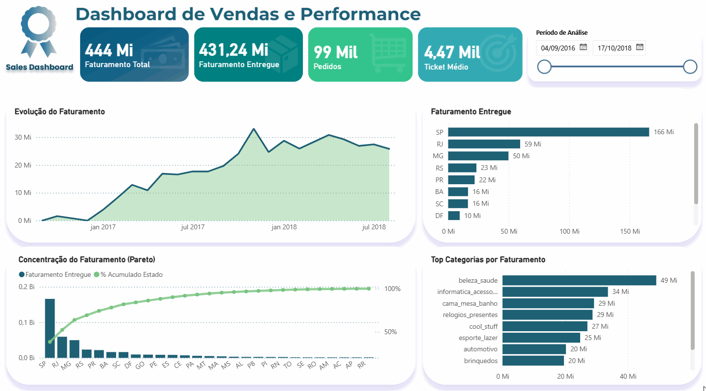

# Sales Performance Dashboard | Análise de Vendas em E-commerce

## Visão Geral

Este projeto apresenta um dashboard interativo desenvolvido em Power BI com foco na análise de performance de vendas em um e-commerce.

O objetivo é transformar dados em informações estratégicas para apoiar a tomada de decisão.

---

## Problema de Negócio

Empresas de e-commerce precisam entender:

- Quais regiões geram mais faturamento
- Se existe concentração de receita (Pareto)
- Como o faturamento evolui ao longo do tempo
- Quais categorias mais impactam o resultado

---

## Solução

Foi desenvolvido um dashboard com:

- KPIs principais (Faturamento, Pedidos, Ticket Médio)
- Evolução do faturamento ao longo do tempo
- Ranking por estado
- Curva de Pareto (80/20)
- Análise por categoria
- Filtro dinâmico de período

---

## Demonstração do Dashboard

  

---

## Principais Insights

- Forte concentração de faturamento em poucos estados
- São Paulo concentra cerca de 39% do faturamento e os 7 principais estados concentram aproximadamente 80% da receita
- Algumas categorias dominam a receita
- Tendência de crescimento ao longo do tempo

---

## Ferramentas

- Power BI
- DAX
- Modelagem de dados
- ETL
---

## Diferenciais

- Aplicação prática de Pareto
- Design com identidade visual própria
- Foco em análise de negócio
---

## Estrutura do Projeto

- `sales-performance-dashboard.pbix`: arquivo principal do dashboard
- `assets/dashboard.gif`: demonstração interativa
- `assets/dashboard.png`: imagem estática do painel

## Como visualizar

1. Baixe o arquivo `.pbix`
2. Abra no Power BI Desktop
3. Explore os filtros e visuais do dashboard
